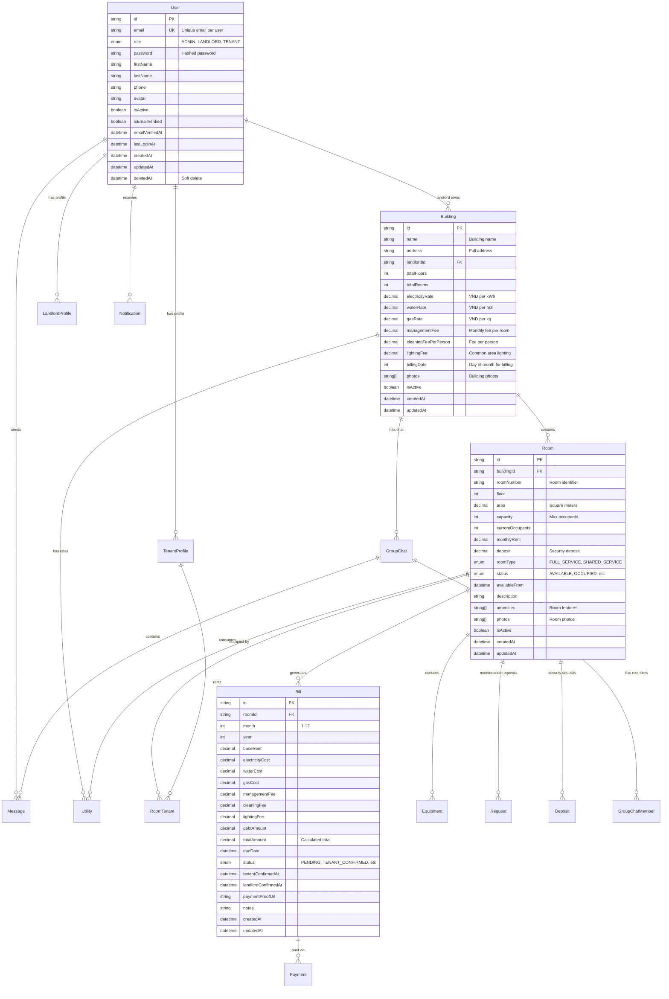

# Database Design Document (DB設計書)
## Tacohouse - Rental Room Management System

### 5.1 Database Schema Overview



### 5.2 Table Specifications

#### 5.2.1 Core Tables

**Users Table**
```sql
CREATE TABLE users (
    id VARCHAR(30) PRIMARY KEY DEFAULT gen_random_cuid(),
    email VARCHAR(255) UNIQUE NOT NULL,
    password VARCHAR(255) NOT NULL,
    role user_role NOT NULL,
    first_name VARCHAR(100),
    last_name VARCHAR(100),
    phone VARCHAR(20),
    avatar TEXT,
    is_active BOOLEAN DEFAULT true,
    is_email_verified BOOLEAN DEFAULT false,
    email_verified_at TIMESTAMP,
    last_login_at TIMESTAMP,
    created_at TIMESTAMP DEFAULT CURRENT_TIMESTAMP,
    updated_at TIMESTAMP DEFAULT CURRENT_TIMESTAMP,
    deleted_at TIMESTAMP
);

-- Indexes
CREATE INDEX idx_users_email ON users(email);
CREATE INDEX idx_users_role ON users(role);
CREATE INDEX idx_users_active ON users(is_active) WHERE deleted_at IS NULL;
```

**Buildings Table**
```sql
CREATE TABLE buildings (
    id VARCHAR(30) PRIMARY KEY DEFAULT gen_random_cuid(),
    name VARCHAR(255) NOT NULL,
    address TEXT NOT NULL,
    landlord_id VARCHAR(30) NOT NULL REFERENCES users(id),
    total_floors INTEGER DEFAULT 1,
    total_rooms INTEGER DEFAULT 0,
    electricity_rate DECIMAL(10,2) DEFAULT 3500.00,
    water_rate DECIMAL(10,2) DEFAULT 25000.00,
    gas_rate DECIMAL(10,2) DEFAULT 15000.00,
    management_fee DECIMAL(10,2) DEFAULT 50000.00,
    cleaning_fee_per_person DECIMAL(10,2) DEFAULT 20000.00,
    lighting_fee DECIMAL(10,2) DEFAULT 30000.00,
    billing_date INTEGER DEFAULT 30 CHECK (billing_date BETWEEN 1 AND 31),
    photos TEXT[] DEFAULT '{}',
    is_active BOOLEAN DEFAULT true,
    created_at TIMESTAMP DEFAULT CURRENT_TIMESTAMP,
    updated_at TIMESTAMP DEFAULT CURRENT_TIMESTAMP
);

-- Indexes
CREATE INDEX idx_buildings_landlord ON buildings(landlord_id);
CREATE INDEX idx_buildings_active ON buildings(is_active);
```

#### 5.2.2 Complex Business Logic Tables

**Bills Table with Complex Calculations**
```sql
CREATE TABLE bills (
    id VARCHAR(30) PRIMARY KEY DEFAULT gen_random_cuid(),
    room_id VARCHAR(30) NOT NULL REFERENCES rooms(id),
    month INTEGER NOT NULL CHECK (month BETWEEN 1 AND 12),
    year INTEGER NOT NULL CHECK (year >= 2024),
    base_rent DECIMAL(12,2) DEFAULT 0,
    electricity_cost DECIMAL(12,2) DEFAULT 0,
    water_cost DECIMAL(12,2) DEFAULT 0,
    gas_cost DECIMAL(12,2) DEFAULT 0,
    management_fee DECIMAL(12,2) DEFAULT 0,
    cleaning_fee DECIMAL(12,2) DEFAULT 0,
    lighting_fee DECIMAL(12,2) DEFAULT 0,
    debt_amount DECIMAL(12,2) DEFAULT 0,
    total_amount DECIMAL(12,2) NOT NULL,
    due_date DATE NOT NULL,
    status bill_status DEFAULT 'PENDING',
    tenant_confirmed_at TIMESTAMP,
    landlord_confirmed_at TIMESTAMP,
    payment_proof_url TEXT,
    notes TEXT,
    created_at TIMESTAMP DEFAULT CURRENT_TIMESTAMP,
    updated_at TIMESTAMP DEFAULT CURRENT_TIMESTAMP,
    
    UNIQUE(room_id, month, year)
);

-- Bill calculation trigger
CREATE OR REPLACE FUNCTION calculate_bill_total()
RETURNS TRIGGER AS $$
BEGIN
    NEW.total_amount = NEW.base_rent + NEW.electricity_cost + NEW.water_cost + 
                      NEW.gas_cost + NEW.management_fee + NEW.cleaning_fee + 
                      NEW.lighting_fee + NEW.debt_amount;
    RETURN NEW;
END;
$$ LANGUAGE plpgsql;

CREATE TRIGGER trigger_calculate_bill_total
    BEFORE INSERT OR UPDATE ON bills
    FOR EACH ROW
    EXECUTE FUNCTION calculate_bill_total();
```

**Utilities Table for Meter Readings**
```sql
CREATE TABLE utilities (
    id VARCHAR(30) PRIMARY KEY DEFAULT gen_random_cuid(),
    building_id VARCHAR(30) REFERENCES buildings(id),
    room_id VARCHAR(30) REFERENCES rooms(id),
    month INTEGER NOT NULL CHECK (month BETWEEN 1 AND 12),
    year INTEGER NOT NULL CHECK (year >= 2024),
    electricity_reading DECIMAL(10,2), -- Current meter reading
    water_reading DECIMAL(10,2),       -- Current meter reading
    gas_reading DECIMAL(10,2),         -- Current meter reading
    electricity_used DECIMAL(10,2),    -- Calculated usage
    water_used DECIMAL(10,2),          -- Calculated usage
    gas_used DECIMAL(10,2),            -- Calculated usage
    reading_date DATE NOT NULL,
    notes TEXT,
    created_at TIMESTAMP DEFAULT CURRENT_TIMESTAMP,
    updated_at TIMESTAMP DEFAULT CURRENT_TIMESTAMP,
    
    UNIQUE(room_id, month, year),
    CHECK (room_id IS NOT NULL OR building_id IS NOT NULL)
);

-- Function to calculate usage based on previous readings
CREATE OR REPLACE FUNCTION calculate_utility_usage()
RETURNS TRIGGER AS $$
DECLARE
    prev_electricity DECIMAL(10,2);
    prev_water DECIMAL(10,2);
    prev_gas DECIMAL(10,2);
BEGIN
    -- Get previous month's readings
    SELECT electricity_reading, water_reading, gas_reading
    INTO prev_electricity, prev_water, prev_gas
    FROM utilities
    WHERE room_id = NEW.room_id
    AND (
        (NEW.month = 1 AND month = 12 AND year = NEW.year - 1) OR
        (month = NEW.month - 1 AND year = NEW.year)
    )
    ORDER BY year DESC, month DESC
    LIMIT 1;
    
    -- Calculate usage
    NEW.electricity_used = COALESCE(NEW.electricity_reading - prev_electricity, 0);
    NEW.water_used = COALESCE(NEW.water_reading - prev_water, 0);
    NEW.gas_used = COALESCE(NEW.gas_reading - prev_gas, 0);
    
    RETURN NEW;
END;
$$ LANGUAGE plpgsql;

CREATE TRIGGER trigger_calculate_utility_usage
    BEFORE INSERT OR UPDATE ON utilities
    FOR EACH ROW
    EXECUTE FUNCTION calculate_utility_usage();
```

### 5.3 Indexing Strategy
